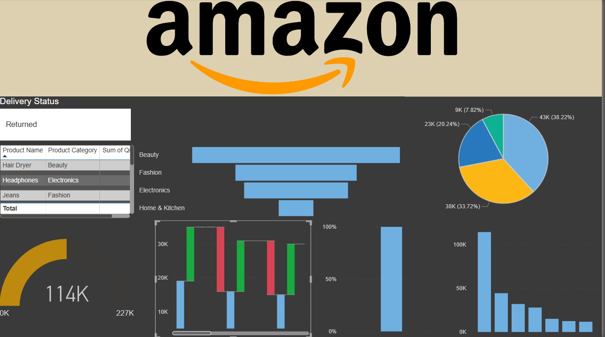
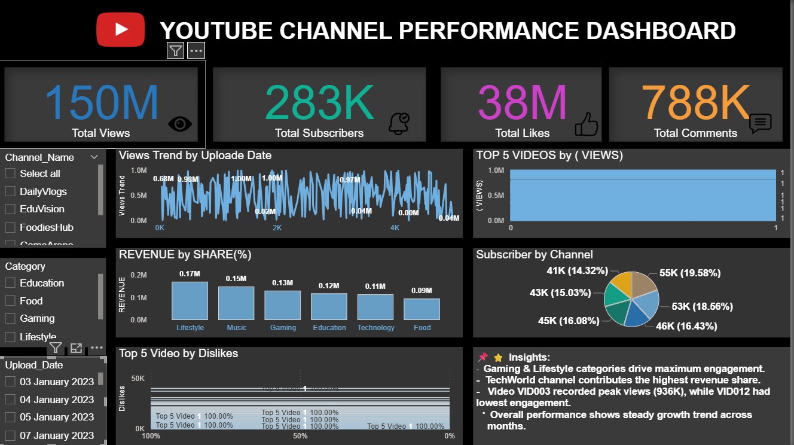

# Power BI Dashboards 📊

This repository contains my Power BI dashboards for different case studies and business analyses.  

---

## 1. Amazon Sales Dashboard
- **Objective:** Analyze Amazon sales trends, profit margins, and customer segments  
- **Skills:** Data Modeling, DAX, KPIs, Drillthrough  
- **File:** [Amazon sales dashboard.pbix](Amazon%20sales%20dashboard.pbix)  
- **Preview:**  
  

---

## 2. YouTube Channel Performance Dashboard
- **Objective:** Track YouTube views, subscriber growth, and revenue trends  
- **Skills:** KPIs, Slicers, Drilldowns  
- **File:** [YouTube Channel Performance Dashboard.pbix](YouTube%20Channel%20Performance%20Dashboard.pbix)  
- **Preview:**  
  

---

## 3. Sales Dashboard
- **Objective:** Visualize sales revenue, product performance, and regional trends  
- **Skills:** Interactive Charts, Filters, Measures  
- **File:** [sales dashboard.pbix](sales%20dashboard.pbix)  
- **Preview:**  
  
